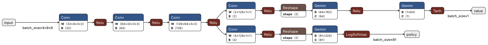
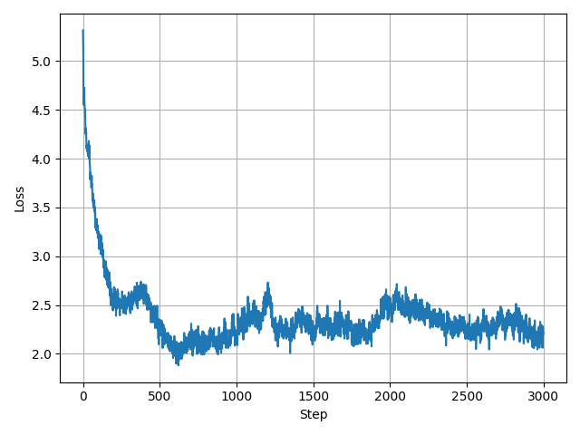
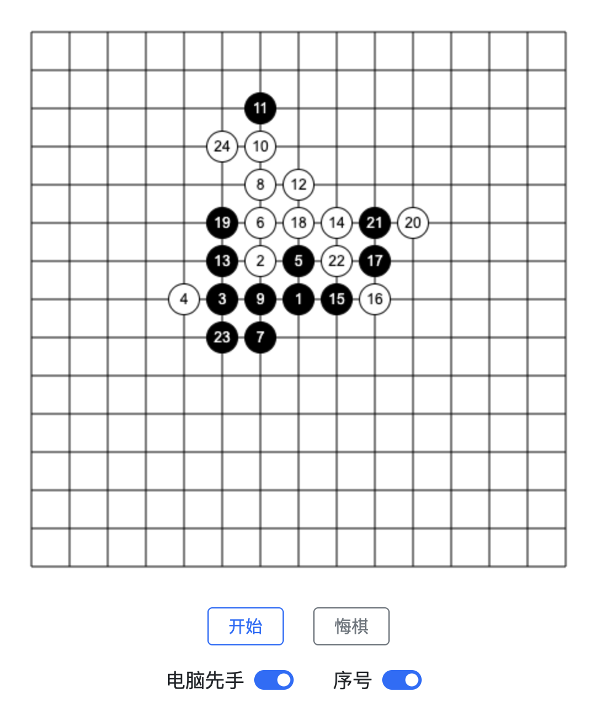

# 基于深度学习与 MCTS 的棋类对弈算法

## 1. 项目介绍

### 1.1 研究背景与研究动机

​	近年来，人工智能在棋类游戏中的应用取得了突破性进展。自 AlphaGo 与 AlphaGo Zero 在围棋领域战胜世界冠军以来，结合深度神经网络与搜索算法的棋类 AI 逐渐成为主流方向。AlphaZero 等 AI 通过强化学习，配合蒙特卡洛树搜索（Monte Carlo Tree Search, MCTS），展现出极强的学习与泛化能力，在国际象棋、围棋、将棋等多个领域均达到了超越人类的水平。

​	然而，尽管这类算法在实力上具有显著优势，但它们通常需要消耗较多的计算资源。因此，如何在确保 AI 实力的同时，实现轻量化、高效率的对弈系统，成为一个具有挑战性且具备实践意义的课题。

​	本项目以五子棋（Gobang）为研究对象，旨在构建一个融合深度学习与 MCTS 的轻量化棋类 AI 系统，探究并行算法对 MCTS 的加速效果，并最终部署到网页，实现完全前端运行。

### 1.2 项目目标与设计要求

本项目的总体目标是开发一个**高性能、可网页部署的五子棋智能对弈系统**。具体包括以下几个方面：

- **高性能**：通过并行 MCTS 推理方式，使每一步决策响应时间缩短。
- **轻量化部署**：将训练好的轻量模型迁移至前端 JavaScript 环境中运行，完全脱离后端依赖，可通过静态网页直接访问。
- **模块完整性**：系统实现从传统搜索算法、神经网络构建、强化学习，到前端推理部署的全流程。

### 1.3 系统功能

支持以下主要功能：

- **多种 AI 对战模式**：包括随机算法（RandomAI）、简单评分算法（SimpleAI）、极小极大搜索（MiniMaxAI）以及基于深度学习的 AlphaAI。
- **人机交互界面**：用户可通过网页界面与 AI 对战，并支持悔棋、先手切换、棋子编号等辅助功能。
- **强化学习训练与网页推理**：AI 模块训练基于 Python 与 PyTorch 实现，推理模块则通过 JavaScript 移植至前端运行环境。

## 2. 解决方法介绍

### 2.1 AI 算法

为了实现具有不同水平的五子棋对弈系统，项目实现了四种 AI 模型：

- **RandomAI**：随机选择一个合法位置落子，作为功能测试。
- **SimpleAI**：采用启发式评分函数评估每个空位，选择得分最高的位置。
- **MiniMaxAI**：实现极小极大搜索与 Alpha-Beta 剪枝，对候选位置启发式排序和剪枝进一步减小搜索空间。
- **AlphaAI**：基于 AlphaZero 思路，结合神经网络和蒙特卡洛树搜索（MCTS），具备较强的策略评估与搜索能力。

**2.1.1 SimpleAI 实现**

简单分数评估：

```typescript
// 根据连子数和封堵情况计算分数
if (count >= 4) return 100; // 五连
if (count === 3 && block === 0) return 50; // 活四
if (count === 3 && block === 1) return 10; // 冲四
if (count === 2 && block === 0) return 5;  // 活三
if (count === 2 && block === 1) return 2;  // 冲三
if (count === 1 && block === 0) return 1;  // 活二
if (count === 1 && block === 1) return 0;  // 冲二
```

对于每个空位，分别计算自己和对手落子的分数再求和，均衡考虑进攻与防御：

```typescript
// 遍历棋盘，计算每个空位置的分数
for (let row = 0; row < this.chessboard.rows; row++) {
    for (let col = 0; col < this.chessboard.cols; col++) {
        if (this.chessboard.board[row][col] === null) {
            // 模拟 AI 落子，计算分数
            scores[row][col] = this.computeScore(row, col, true);
            // 模拟对手落子，计算威胁分数
            scores[row][col] += this.computeScore(row, col, false);
        }
    }
}
```

**2.1.2 MiniMaxAI 实现**

评分表：

```typescript
private static ScoreTable = {
    "11111": 50000,
    "+1111+": 4320,
    "+111++": 720,
    "++111+": 720,
    "+11+1+": 720,
    "+1+11+": 720,
    "1111+": 720,
    "+1111": 720,
    "11+11": 720,
    "1+111": 720,
    "111+1": 720,
    "++11++": 120,
    "++1+1+": 120,
    "+1+1++": 120,
    "+++1++": 20,
    "++1+++": 20,
};
```

MiniMax 搜索树与 Alpha-Beta 剪枝：

```typescript
const result = this.checkWin(row, col)
    ? this.minimax(0, !isMaximizing, alpha, beta) // 如果游戏结束，直接调用 minimax，深度为 0
    : this.minimax(depth - 1, !isMaximizing, alpha, beta); // 否则继续递归调用 minimax
```

```typescript
// 更新最佳分数和最佳落子位置
if (isMaximizing) {
    if (result.score > bestScore) {
        bestScore = result.score;
        bestMove = { row, col };
    }
    alpha = Math.max(alpha, bestScore); // 更新 alpha
} else {
    if (result.score < bestScore) {
        bestScore = result.score;
        bestMove = { row, col };
    }
    beta = Math.min(beta, bestScore); // 更新 beta
}
```

候选位置启发式排序和剪枝：

```typescript
// 根据分数排序
candidates.sort((a, b) => isMaximizing ? b.score - a.score : a.score - b.score);
// 只取前十个候选点
const topCandidates = candidates.slice(0, 10);
// 返回排序后的候选点（去掉分数字段）
return topCandidates.map(({ row, col }) => ({ row, col }));
```

### **2.2 强化学习训练流程**

AlphaAI 采用强化学习方式，通过自我博弈持续优化策略网络：

1. **策略-价值网络结构**：输入为 9×9 棋盘状态，输出包括每个位置的落子概率（policy）与当前局面的胜负估计（value）。网络特征构建部分仅使用 3 个卷积层，使用 PyTorch 实现。
2. **数据生成**：使用当前模型进行自对弈，记录每步的棋盘状态、MCTS 概率分布和最终胜负结果。
3. **训练细节**：加入棋盘旋转与翻转数据增强，引入 Dirichlet 噪声增强探索性；使用交叉熵与均方误差作为损失函数；采用梯度裁剪提高训练稳定性。



神经网络：

```python
class Net(nn.Module):
    """policy-value network module"""

    def __init__(self, board_width, board_height):
        super(Net, self).__init__()

        self.board_width = board_width
        self.board_height = board_height
        # common layers
        self.conv1 = nn.Conv2d(4, 32, kernel_size=3, padding=1)
        self.conv2 = nn.Conv2d(32, 64, kernel_size=3, padding=1)
        self.conv3 = nn.Conv2d(64, 128, kernel_size=3, padding=1)
        # action policy layers
        self.act_conv1 = nn.Conv2d(128, 4, kernel_size=1)
        self.act_fc1 = nn.Linear(
            4 * board_width * board_height, board_width * board_height
        )
        # state value layers
        self.val_conv1 = nn.Conv2d(128, 2, kernel_size=1)
        self.val_fc1 = nn.Linear(2 * board_width * board_height, 64)
        self.val_fc2 = nn.Linear(64, 1)

    def forward(self, state_input):
        # common layers
        x = F.relu(self.conv1(state_input))
        x = F.relu(self.conv2(x))
        x = F.relu(self.conv3(x))
        # action policy layers
        x_act = F.relu(self.act_conv1(x))
        x_act = x_act.view(-1, 4 * self.board_width * self.board_height)
        x_act = F.log_softmax(self.act_fc1(x_act), dim=1)
        # state value layers
        x_val = F.relu(self.val_conv1(x))
        x_val = x_val.view(-1, 2 * self.board_width * self.board_height)
        x_val = F.relu(self.val_fc1(x_val))
        x_val = F.tanh(self.val_fc2(x_val))
        return x_act, x_val
```

### 2.3 并行 MCTS 优化

**2.3.1 MCTS 实现**

​	MCTS（蒙特卡洛树搜索）是一种用于决策问题的启发式搜索算法，特别适用于状态空间较大、评估函数难以设计的问题。其核心流程包括四个阶段：

1. **选择（Selection）**：从根节点出发，依次选择具有最大置信上界（Upper Confidence Bound, UCB）的子节点，直至达到叶节点。
2. **扩展（Expansion）**：在当前节点添加可行的下一步状态作为子节点。
3. **模拟（Simulation）**：从扩展后的新节点开始，进行一次随机或策略引导的对局模拟，直至对局结束。
4. **回传（Backpropagation）**：根据模拟结果，沿路径回传更新节点访问次数与累计胜率。

​	本项目的 MCTS 结合策略-价值网络进行模拟，其中选择策略为：
$$
U(s, a) = Q(s, a) + c_{puct} \cdot P(s, a) \cdot \frac{\sqrt{\sum_b N(s, b)}}{1 + N(s, a)}
$$
其中：

- $Q(s, a)$：当前动作的平均价值；
- $P(s, a)$：由神经网络提供的先验概率；
- $N(s, a)$：动作访问次数；
- $c_{puct}$：调节探索程度的常数。

​	每次落子前，MCTS 会基于当前棋盘状态执行若干次模拟，最终选择访问次数最多的动作作为最终决策。

```python
def get_value(self, c_puct):
    self._u = (
        c_puct * self._P * np.sqrt(self._parent._n_visits) / (1 + self._n_visits)
    )
    return self._Q + self._u
        
def update(self, leaf_value):
    self._n_visits += 1
    self._Q += 1.0 * (leaf_value - self._Q) / self._n_visits
```

**2.3.2 MCTS 并行**

MCTS 在推理时需多次模拟，单进程执行效率较低。为提升推理速度，实现了并行 MCTS：

- **树并行（Tree Parallelism）**：多个进程共享搜索树，独立进行节点模拟。
- **虚拟损失（Virtual Loss）机制**：防止多进程重复访问同一节点，提升模拟效率。
- **多进程实现**：使用 Python 的 multiprocessing 模块进行任务调度，利用回调函数实现同步，最终在多核 CPU 和 GPU 上获得加速。

```python
self.pool = Pool(processes=n_jobs or cpu_count())
task = self.pool.apply_async(
    inference_task, args=(state_copy,), callback=cb
)
```

```python
def add_virtual_loss(self, loss=1.0):
    self._n_visits += 1
    self._W -= loss
def revert_virtual_loss(self, loss=1.0):
    self._n_visits -= 1
    self._W += loss
```

### **2.4 模型部署与前端实现**

为了实现轻量级部署，模型被迁移至浏览器前端运行：

- **模型导出**：将 PyTorch 训练好的网络权重转为 ONNX 格式，通过 JavaScript 加载。
- **前端推理**：使用 TypeScript 实现 MCTS 推理逻辑，在浏览器中进行每一步决策计算。
- **用户交互界面**：通过 HTML5 Canvas 绘制棋盘，实现玩家点击落子、AI 响应、悔棋等功能。
- **静态部署**：所有资源部署于 GitHub Pages，无需后端服务器，用户即可在线体验。

```javascript
async loadModel() {
    try {
        this.session = await ort.InferenceSession.create(this.modelPath);
    } catch (err) {
        console.error("ONNX模型加载失败:", err);
    }
}
```

## 3. 实验结果展示及分析

### 3.1 系统模块实现概览

​	项目完整实现了五子棋 AI 系统的各个关键模块，涵盖从基础 AI 策略到强化学习训练、并行推理优化与前端部署，具体如下：

- **传统 AI 模型**：实现了 RandomAI、SimpleAI、MiniMaxAI 等基础对弈算法。
- **神经网络训练模块**：基于 PyTorch 构建策略-价值网络，并实现了完整的自我博弈数据生成、训练与迭代流程。
- **蒙特卡洛树搜索（MCTS）**：实现了神经网络引导的 MCTS 推理算法，支持策略概率引导与模拟回传。
- **并行优化**：通过 Python 多进程加速 MCTS 推理，在保证实力的同时提升响应速度。
- **网页前端部署**：将训练后的模型转换为 ONNX 格式，使用 JavaScript 与 HTML5 Canvas 实现交互式人机对战界面，用户可直接在浏览器中体验 AI。

### 3.2 AlphaAI 训练与对战效果评估

​	训练过程中每步生成一局自对弈数据，然后训练若干个 epoch，总共生成 3000 局对弈数据，训练损失曲线如下。

<div align="center">
  
</div>

​	为验证 AlphaAI 的对弈能力，将训练后的神经网络与传统纯 MCTS 策略进行对战测试：

- **实验设置**：
  - AlphaAI：每步执行 400 次 MCTS 模拟。
  - 纯 MCTS：每步执行 5000 次模拟。
  - 棋盘大小：9×9，胜利条件为五子连珠。
  - 执行 10 局对战，双方轮流先手。
- **实验结果**：
  - AlphaAI 胜出 10 局，对纯 MCTS 达到压倒性优势。

​	该实验说明，尽管 AlphaAI 每步模拟次数远低于纯 MCTS，但借助神经网络策略的引导，其实际策略质量显著更优，在多数复杂局面下，能够做出优于传统算法的选择。

### **3.3 并行 MCTS 性能测试**

​	为测试并行 MCTS 的推理效率提升效果，分别对使用神经网络的 MCTS 和纯 MCTS 进行了性能评估。每组测试运行 3 次，取平均值。每步均进行 1000 次模拟，测试机器为 8 核 CPU 和 NVIDIA A100。

- **使用神经网络的 MCTS 测试结果：**

```
MCTSPlayer（串行）: avg_time = 1.7381s, playout/s = 575.3
MCTSPlayer（并行）: avg_time = 0.3749s, playout/s = 2667.4
```

- **纯 MCTS ：**

```
MCTSPlayer（串行）: avg_time = 2.7728s, playout/s = 360.7
MCTSPlayer（并行）: avg_time = 0.6100s, playout/s = 1639.4
```

- **加速分析**：
  - 并行 MCTS 在两个模块中均取得了约 4~5 倍的速度提升。
  - 使用轻量神经网络的 MCTS 比基于随机模拟的纯 MCTS 速度更快。

### **3.4 系统部署与可视化效果**

前端网页部署使用 TypeScript 编写，用户可访问以下页面进行在线体验：

- [MiniMaxAI 版本](https://hyjwpk.github.io/Gobang)
- [AlphaAI 版本（深度学习+MCTS）](https://hyjwpk.github.io/Gobang/alpha)

前端实现了以下功能：

- 棋盘点击落子、AI 自动回应；
- 棋子编号、悔棋、先手切换功能；
- 自适应 Canvas 渲染与模型异步加载；
- 无需后端服务器，支持 GitHub Pages 静态托管，用户可直接访问使用。

页面加载速度较快，模型推理响应时间控制在 1 秒以内，基本满足交互式对战需求。

<div align="center">
  
</div>

## 4. 展望与体会

### 4.1 后续工作展望

​	本项目已实现五子棋 AI 的完整系统流程，但仍有一些值得进一步探索的方向。例如，在模型层面，可以引入更轻量或结构更优的神经网络，如残差网络（ResNet）或注意力机制。在部署层面，可考虑采用模型压缩与 WebAssembly 等技术提升前端推理效率。此外，未来还可以拓展至其他棋类游戏。

### 4.2 项目实施体会

​	通过本项目，我实现了完整的强化学习与搜索算法系统，对它们的结合方式和实现细节有了扎实掌握。并行 MCTS 的实现难度较高，涉及多进程通信、共享数据同步等问题，对工程实现能力提出了较大挑战。同时，前端部署部分也让我认识到轻量化 AI 系统在实际应用中的价值。

​	在强化学习训练过程中，我深刻体会到策略迭代、自我博弈以及神经网络引导搜索之间的协同关系。尤其是在实现 AlphaZero 式自我对弈训练时，如何高效生成训练数据、设计合理的损失函数与调参策略，对最终模型性能起到关键作用。训练初期模型不稳定、胜负信号稀疏等问题也让我意识到数据增强与探索策略（如 Dirichlet 噪声）的必要性。

​	通过本项目，我系统实践了高级人工智能课程中学习的 MiniMax 算法、Alpha-Beta 剪枝、蒙特卡洛树搜索、神经网络模型构建与训练、卷积神经网络、强化学习、博弈论等知识，对人工智能系统的整体构建有了更全面的认识，也提升了从底层算法到前端交互的全流程开发能力。

## 参考资料

[1] Silver D, Schrittwieser J, Simonyan K, et al. Mastering the game of go without human knowledge[J]. nature, 2017, 550(7676): 354-359.

[2] Silver D, Hubert T, Schrittwieser J, et al. Mastering chess and shogi by self-play with a general reinforcement learning algorithm[J]. arXiv preprint arXiv:1712.01815, 2017.

[3] Mirsoleimani S A, Plaat A, van den Herik H J, et al. An Analysis of Virtual Loss in Parallel MCTS[C]//ICAART (2). 2017: 648-652.

[4] junxiaosong. AlphaZero_Gomoku. GitHub. https://github.com/junxiaosong/AlphaZero_Gomoku